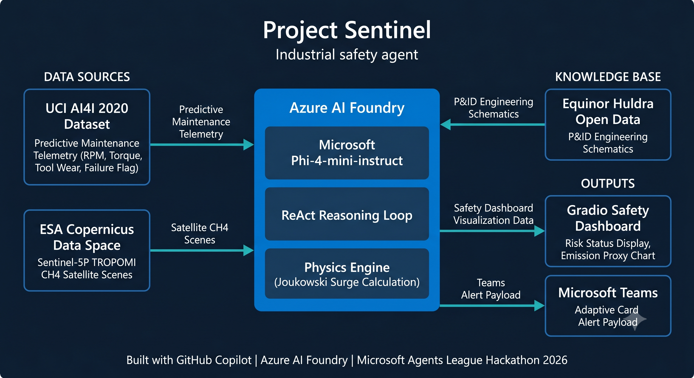

# Project Sentinel 🛡️

### Microsoft Agents League Hackathon 2026 — Reasoning Agents Track

### Powered by Azure AI Foundry and Microsoft Phi-4-mini-instruct

Project Sentinel is an autonomous industrial safety agent that combines predictive maintenance telemetry, satellite methane monitoring, engineering schematics, and AI reasoning to help engineers identify equipment failures, reduce fugitive emissions, and respond faster to industrial safety incidents.

Built by a solo mechatronics engineer using Azure AI Foundry, Microsoft Phi-4-mini-instruct, GitHub Copilot, and Microsoft Teams.

---

# 🚀 Quick Links

### 🎬 Demo Video

https://www.youtube.com/watch?v=qJLnQ7RXbOg

### 🌐 Live Demo

https://sauravsen34-project-sentinel.hf.space

### 📂 GitHub Repository

https://github.com/sauravsen3/Project_Sentinel

---

# ⚠️ The Problem

Heavy energy infrastructure such as offshore platforms, processing facilities, and industrial plants rely on thousands of interconnected mechanical systems.

When equipment begins to fail, engineers often face two simultaneous challenges:

* Detecting mechanical degradation before a critical failure occurs
* Identifying the correct isolation and mitigation procedures buried within large engineering document sets

At the same time, fugitive methane emissions remain one of the most significant industrial contributors to climate change.

During a developing incident, valuable minutes can be lost manually reviewing documentation and correlating operational data.

Project Sentinel was designed to reduce this delay by providing a reasoning-based industrial safety agent that combines multiple information sources into a single operational view.

---

# 💡 Solution

Project Sentinel continuously combines:

* Predictive maintenance telemetry
* Satellite methane observations
* Engineering schematics
* Physics-based safety calculations
* AI reasoning

to generate grounded safety assessments and recommended mitigation actions.

The system keeps humans in the decision loop while reducing the time required to investigate potential failures.

---

# ☁️ Microsoft AI Components

Project Sentinel is built around Microsoft technologies:

| Technology                    | Purpose                                   |
| ----------------------------- | ----------------------------------------- |
| Azure AI Foundry              | Agent orchestration and model deployment  |
| Microsoft Phi-4-mini-instruct | Industrial safety reasoning               |
| GitHub Copilot                | AI-assisted development and documentation |
| Microsoft Teams               | Adaptive Card alert delivery              |

Azure AI Foundry serves as the central reasoning layer responsible for synthesising telemetry, methane observations, engineering documentation, and physics calculations into actionable safety recommendations.

---

# 🧠 Agent Workflow

The agent follows a ReAct-inspired reasoning process:

1. Observe equipment telemetry
2. Detect abnormal operating conditions
3. Retrieve the latest methane observations
4. Ground reasoning against engineering schematics
5. Evaluate hydraulic safety constraints
6. Assess operational risk
7. Generate mitigation recommendations
8. Create Teams alert payload

Output structure:

THOUGHT

↓

RISK LEVEL

↓

RECOMMENDED ACTION

↓

CAVEAT

This ensures every recommendation is accompanied by context and safety limitations.

---

# 🏗️ System Architecture



```text
┌─────────────────────┐
│ UCI AI4I Telemetry  │
└──────────┬──────────┘
           │
           ▼

┌─────────────────────────────────┐
│ Azure AI Foundry                │
│ Phi-4-mini-instruct             │
│ ReAct Reasoning Loop            │
│ Physics-Based Safety Engine     │
└───────┬───────────────┬─────────┘
        │               │

        ▼               ▼

┌───────────────┐   ┌───────────────┐
│ ESA Sentinel  │   │ Equinor Huldra│
│ Methane Data  │   │ P&ID Schematics│
└───────────────┘   └───────────────┘

                │
                ▼

      ┌──────────────────┐
      │ Teams Alerting   │
      │ Adaptive Cards   │
      └──────────────────┘
```

---

# 📊 Public Data Sources

| Source                                       | Purpose                          | Licence         |
| -------------------------------------------- | -------------------------------- | --------------- |
| UCI AI4I 2020 Predictive Maintenance Dataset | Equipment telemetry              | CC BY 4.0       |
| ESA Sentinel-5P TROPOMI                      | Atmospheric methane observations | ESA Open Access |
| Equinor Huldra P&IDs                         | Engineering schematic grounding  | Open Data       |

All datasets used are publicly available.

UCI AI4I 2020 Predictive Maintenance Dataset
Link: [https://archive.ics.uci.edu/dataset/601/ai4i+2020+predictive+maintenance+dataset](url)

ESA Sentinel-5P TROPOMI 
Link: [https://www.tropomi.eu/data-products/carbon-monoxide](url)

Equinor Huldra P&IDs 
Link: [https://www.equinor.com/energy/data-sharing](url)
No proprietary industrial data is used anywhere within the project.

---

# ⚙️ Technical Features

## Azure AI Foundry Reasoning

Microsoft Phi-4-mini-instruct generates grounded industrial safety assessments using telemetry, methane observations, engineering schematics, and physics constraints.

---

## Live Methane Monitoring

Project Sentinel retrieves methane scene metadata from the ESA Copernicus Data Space catalogue using the Sentinel-5P TROPOMI mission.

This allows the agent to incorporate real environmental observations into its safety assessment workflow.

---

## Physics-Based Safety Calculations

The system incorporates engineering calculations including hydraulic transient estimation using the Joukowski equation.

This helps ensure recommendations remain physically plausible rather than relying solely on language-model reasoning.

---

## Engineering Document Grounding

Recommendations are grounded in publicly released offshore engineering schematics from the Equinor Huldra platform.

This reduces hallucinations and improves operational relevance.

---

## Microsoft Teams Integration

Project Sentinel generates Adaptive Card payloads suitable for routing into Microsoft Teams workflows and incident response channels.

---

## Transparent Fallback Handling

Every data source contains clearly labelled fallback behaviour.

The system never presents unavailable data as live data.

---

# 📈 Example Incident

### Input

* Machine temperature: 310 K
* Tool wear: 245 min
* Torque: 75 Nm
* Methane anomaly detected

### Agent Assessment

Risk Level: HIGH

### Recommended Action

Inspect isolation valve V-201 before restart and verify pressure conditions prior to reopening.

### Caveat

All recommendations require validation by a qualified field engineer before implementation.

---

# 🌍 Impact

Project Sentinel demonstrates how AI reasoning agents can support:

* Industrial worker safety
* Methane emissions reduction
* Faster incident investigation
* Reduced documentation search time
* Human-in-the-loop decision making

The project explores how modern AI systems can augment engineering expertise rather than replace it.

---

# 👨‍💻 Solo Project

Project Sentinel was designed, developed, tested, deployed, and documented by a single developer during the Microsoft Agents League Hackathon 2026.

Areas covered include:

* Agent architecture
* Azure AI Foundry integration
* Satellite data ingestion
* Engineering document grounding
* User interface development
* Deployment
* Documentation

---

# 🚀 Running the Project

## Live Demo

Visit:

https://sauravsen34-project-sentinel.hf.space

---

## Local Setup

```bash
pip install -r requirements.txt

export AZURE_OPENAI_KEY="your-key"
export AZURE_OPENAI_ENDPOINT="your-endpoint"
export AZURE_DEPLOYMENT="Phi-4-mini-instruct"

python sentinel_dashboard.py
```

---

## Databricks

Open:

Project_Sentinel_Brain.ipynb

Run all cells.

---

# 🔒 Safety Notice

This project is a research prototype.

All risk assessments are advisory only.

Project Sentinel does not perform automated shutdowns, valve operations, or safety-critical control actions.

All recommendations must be reviewed and approved by qualified personnel before implementation.

---

# 👤 Author

Saurav Sen

Mechatronics Engineer

Microsoft Agents League Hackathon 2026

---

# License

MIT License

Copyright (c) 2026 Saurav Sen
